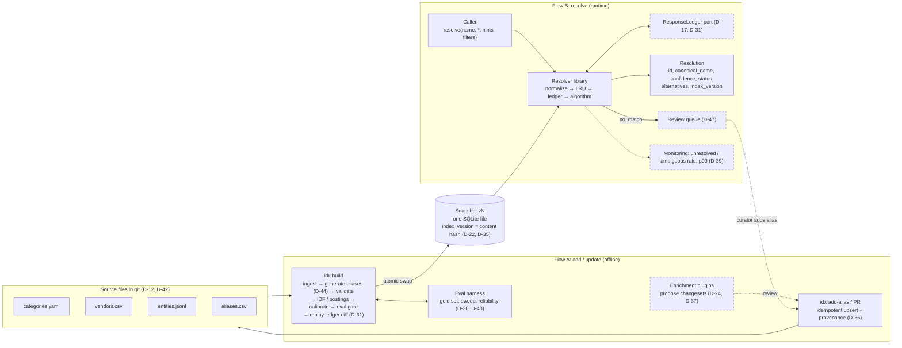

# Architecture

Components from V3 §11; Flow A (add / update) and Flow B (resolve) from V3 §2.
Dashed boxes are stubs in code (D-30, D-37, D-43).

```mermaid
flowchart LR
    subgraph SRC["Source files in git (D-12, D-42)"]
        CAT[categories.yaml]
        VEN[vendors.csv]
        ENT[entities.jsonl]
        ALI[aliases.csv]
    end

    subgraph A["Flow A: add / update (offline)"]
        direction TB
        UPD["idx add-alias / PR<br/>idempotent upsert + provenance (D-36)"]
        PLUG["Enrichment plugins<br/>propose changesets (D-24, D-37)"]:::stub
        BUILD["idx build<br/>ingest → generate aliases (D-44) → validate<br/>→ IDF / postings → calibrate → eval gate<br/>→ replay ledger diff (D-31)"]
        EVAL["Eval harness<br/>gold set, sweep, reliability (D-38, D-40)"]
    end

    SNAP[("Snapshot vN<br/>one SQLite file<br/>index_version = content hash (D-22, D-35)")]

    subgraph B["Flow B: resolve (runtime)"]
        direction TB
        CALLER["Caller<br/>resolve(name, *, hints, filters)"]
        LIB["Resolver library<br/>normalize → LRU → ledger → algorithm"]
        LEDGER["ResponseLedger port (D-17, D-31)"]:::stub
        RES["Resolution<br/>id, canonical_name, confidence, status,<br/>alternatives, index_version"]
        RQ["Review queue (D-47)"]:::stub
        MON["Monitoring: unresolved / ambiguous rate, p99 (D-39)"]:::stub
    end

    UPD --> SRC
    PLUG -.->|review| UPD
    SRC --> BUILD
    BUILD <--> EVAL
    BUILD -->|atomic swap| SNAP
    CALLER --> LIB
    SNAP --> LIB
    LIB <--> LEDGER
    LIB --> RES
    LIB -->|no_match| RQ
    LIB -.-> MON
    RQ -.->|curator adds alias| UPD

    classDef stub stroke-dasharray: 5 5
```
